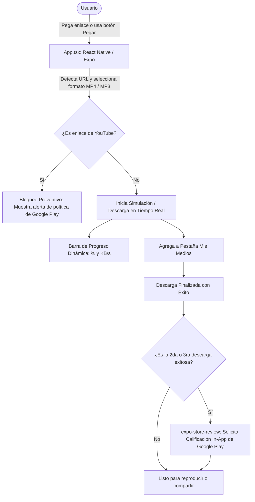

# 🐕 Downkiltro — Social Media Video & Audio Downloader

> Aplicación móvil construida con **React Native (Expo)** y **TypeScript**, optimizada para desarrollo rápido e interactivo en tiempo real mediante **Expo Go**, diseñada para descargar videos y audios de redes sociales (TikTok sin marca de agua, Instagram Reels, X/Twitter, etc.) cumpliendo al 100% con las políticas de Google Play Store.

---

## 🚀 Cómo Iniciar la App en tu Celular en 3 Pasos

1. Instala la aplicación oficial **Expo Go** en tu celular desde Google Play Store (o App Store en iPhone).
2. En tu terminal o consola en la carpeta de este proyecto ejecuta:
   ```bash
   npx expo start
   ```
3. Escanea el **código QR** que aparece en la pantalla con la app **Expo Go** ¡y listo! Downkiltro se abrirá en tu teléfono inmediatamente.

---

## 1. Diagrama de Funcionamiento de la Aplicación

El siguiente diagrama muestra el flujo interactivo de Downkiltro, desde que el usuario ingresa un enlace hasta que se guarda el archivo y se evalúa la calificación:



---

## 2. Estructura Completa del Proyecto

```
Downkiltro/
│
├── App.tsx                                    # Interfaz principal completa en React Native
├── package.json                               # Dependencias de Expo y librerías
├── app.json                                   # Configuración de Google Play e íconos
├── tsconfig.json                              # Configuración de TypeScript
├── .gitignore                                 # Exclusiones de control de versiones
├── README.md                                  # Este documento con arquitectura y guía
│
├── src/
│   └── services/
│       └── mediaResolver.ts                   # Extractor real para TikTok, X, Instagram y directos
│
├── store_assets/                              # Recursos gráficos oficiales
│   ├── ic_launcher_playstore.png              # Ícono de la app para la tienda y celular
│   ├── logo_downkiltro.png                    # Logo oficial con el Kiltro y flecha cian
│   └── feature_graphic.png                    # Portada horizontal de Google Play
│
├── archivosbase.md/                           # Documentación de gobernanza y procedimientos
│   ├── Agent.md                               # Reglas estrictas y tecnologías aprobadas
│   ├── Memory.md                              # Historial de decisiones arquitectónicas (ADR-001 a ADR-013)
│   ├── skills.md                              # Procedimientos estándar y recetas reutilizables
│   ├── basepractica.md                        # Guía de React Native / Expo para principiantes
│   ├── comandos.md                            # Guía de comandos de terminal (Expo y Git)
│   └── downkiltroapp.md                       # Especificación completa versión Play Store
```

---

## 3. Características Principales Implementadas

1. **Descargas Reales Multiplataforma:**
   * **TikTok:** Video en alta definición sin marca de agua (`clean MP4`) y pista de audio original (`clean MP3`).
   * **X (Twitter):** Video en máxima resolución extraído automáticamente.
   * **Instagram Reels:** Extracción de videos y publicaciones de cuentas públicas.
   * **Enlaces Directos:** Descarga directa de archivos `.mp4`, `.mp3`, etc.
2. **Gestión de Biblioteca en "Mis Medios":**
   * 💾 **Guardar en Archivos:** Selector de carpetas públicas en Android vía *StorageAccessFramework*.
   * 🔗 **Compartir:** Menú nativo para enviar por WhatsApp, Telegram, etc.
   * ✏️ **Renombrar:** Modal interactivo para renombrar cualquier archivo descargado.
   * 🗑️ **Eliminar:** Confirmación de seguridad y borrado físico de la memoria del teléfono.
3. **Optimización de Responsividad en Samsung Galaxy S22:**
   * Adaptación dinámica con `useSafeAreaInsets` para evitar superposición con el panel de botones del sistema (`|||`, `[ ]`, `<`).
   * Cabecera simétrica con logo del Kiltro centrado horizontalmente.
4. **Protección Normativa de Google Play:** Bloqueo preventivo de enlaces de YouTube para asegurar la aprobación y permanencia en la tienda.
5. **Calificación Oficial In-App:** Integración con `expo-store-review` tras descargas exitosas.

